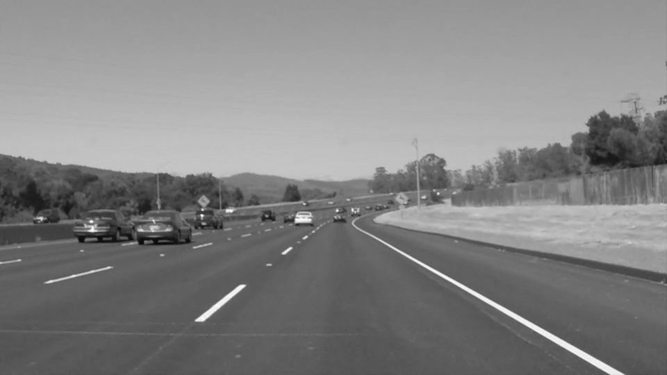
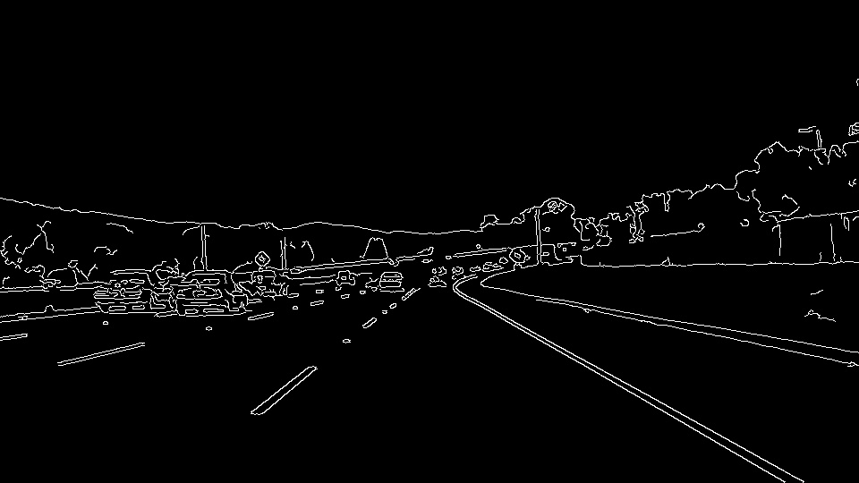
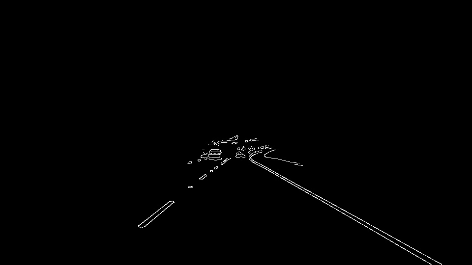
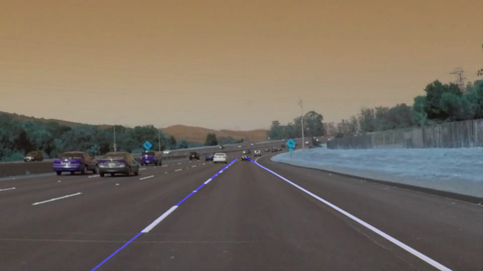

Overview
---

When we drive, we use our eyes to decide where to go.  The lines on the road that show us where the lanes are act as our constant reference for where to steer the vehicle.  Naturally, one of the first things we would like to do in developing a self-driving car is to automatically detect lane lines using an algorithm.

In this project you will detect lane lines in images using Python and OpenCV.

Proposed Solution
---
* Start with an image or frame from a video clip

* Convert the image to grayscale

* Apply Gaussian smoothing

* Apply Canny edge detection function

* Create mask on image to define working region

* Apply Hough transform on the selected region

* Draw lines on top of original image

Outcome
---

The results can be seen in this [video](test_videos_output/solidWhiteRight.mp4)